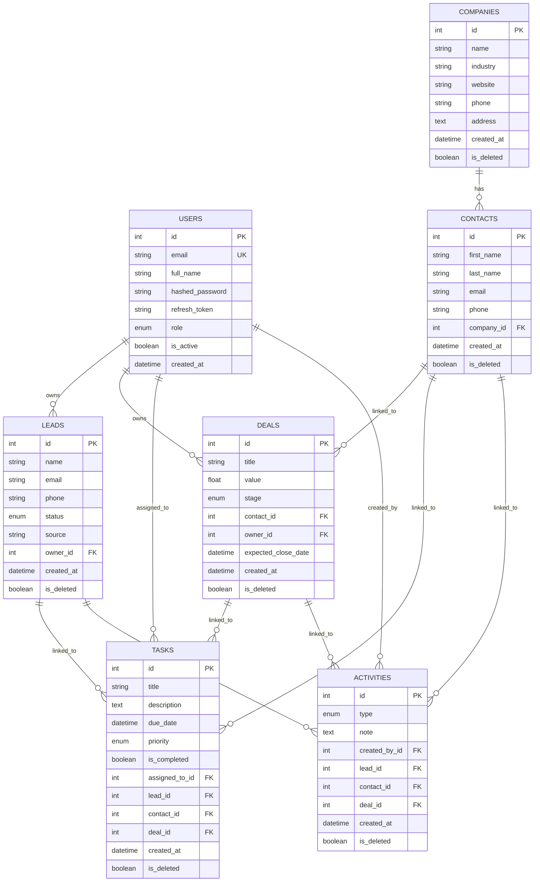

# ClientFlow CRM — Entity Relationship Diagram

```mermaid
erDiagram
    USERS ||--o{ LEADS : owns
    USERS ||--o{ DEALS : owns
    USERS ||--o{ TASKS : assigned_to
    USERS ||--o{ ACTIVITIES : created_by
    COMPANIES ||--o{ CONTACTS : has
    CONTACTS ||--o{ DEALS : linked_to
    CONTACTS ||--o{ TASKS : linked_to
    CONTACTS ||--o{ ACTIVITIES : linked_to
    LEADS ||--o{ TASKS : linked_to
    LEADS ||--o{ ACTIVITIES : linked_to
    DEALS ||--o{ TASKS : linked_to
    DEALS ||--o{ ACTIVITIES : linked_to

    USERS {
        int id PK
        string email UK
        string full_name
        string hashed_password
        string refresh_token
        enum role
        boolean is_active
        datetime created_at
    }

    COMPANIES {
        int id PK
        string name
        string industry
        string website
        string phone
        text address
        datetime created_at
        boolean is_deleted
    }

    CONTACTS {
        int id PK
        string first_name
        string last_name
        string email
        string phone
        int company_id FK
        datetime created_at
        boolean is_deleted
    }

    LEADS {
        int id PK
        string name
        string email
        string phone
        enum status
        string source
        int owner_id FK
        datetime created_at
        boolean is_deleted
    }

    DEALS {
        int id PK
        string title
        float value
        enum stage
        int contact_id FK
        int owner_id FK
        datetime expected_close_date
        datetime created_at
        boolean is_deleted
    }

    TASKS {
        int id PK
        string title
        text description
        datetime due_date
        enum priority
        boolean is_completed
        int assigned_to_id FK
        int lead_id FK
        int contact_id FK
        int deal_id FK
        datetime created_at
        boolean is_deleted
    }

    ACTIVITIES {
        int id PK
        enum type
        text note
        int created_by_id FK
        int lead_id FK
        int contact_id FK
        int deal_id FK
        datetime created_at
        boolean is_deleted
    }
```
